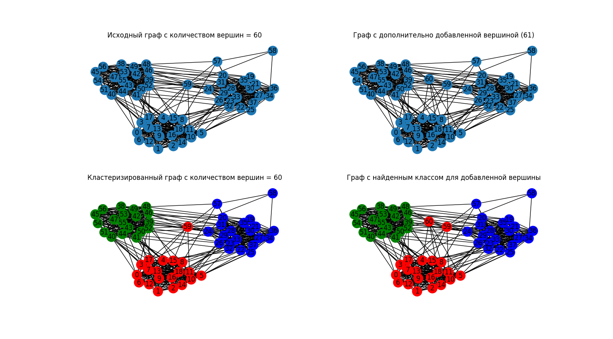

# KNN для графов

## Поставленная задача:
Написать скрипт, который вычисляет Knn(K)
для ненаправленной, невзвешенной сети, представленной списком ребер
При взаимодействии с юзером использовать правильную терминологию

## Запуск программы:
Клонируем репозиторий:
```bash
git clone https://github.com/tooyoungforthis/kNN_graph
```

Откроем папку с репозиторием
```bash
cd kNN_graph
```

Создадим виртуальное окружение
```bash
python -m venv venv
```

Активируем виртуальное окружение
```bash
.\venv\Scripts\activate
```

Установим необходимые зависимости
```bash
pip install -r requirements.txt
```

Запустим приложение
```bash
python main.py
```

## Рассуждения:
Ненаправленная, невзвешенная сеть - это граф ненаправленный, невзвешенный граф
для knn нужно какое-то расстояние, но в нашем случае граф невзвешенный,
поэтому за расстояние будем брать кол-во ребер по котором мы прошли
например: вершина 1 соединена с вершиной 2, а вершина 2 соединена с вершиной 3,
причем вершина 1 и 3 не соединены.
Тогда расстояние между 1 и 3 вершинами будет равно 2
будем рисовать граф и смотреть его построение при различном кол-ве соседей

## Алгоритм решения:


## Реузльтат



